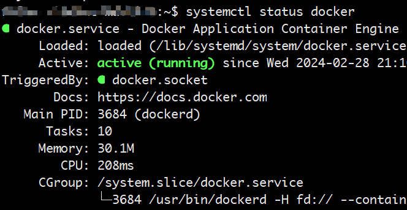
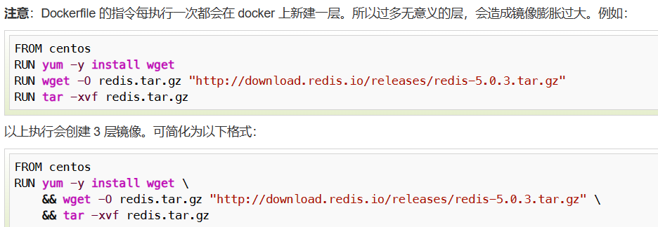

# docker学习

## ubuntu安装docker

1. 卸载自带的docker

```shell
apt remove docker docker-engine docker.io containerd runc
```

2. 更新Ubuntu软件包列表和已安装软件的版本

```shell
sudo apt update
```

3. 安装docker依赖

```shell
apt install ca-certificates curl gnupg lsb-release
```

4. 添加Docker官方GPG密钥

```shell
curl -fsSL http://mirrors.aliyun.com/docker-ce/linux/ubuntu/gpg | sudo apt-key add -
```

5. 添加Docker的软件源

```shell
sudo add-apt-repository "deb [arch=amd64] http://mirrors.aliyun.com/docker-ce/linux/ubuntu $(lsb_release -cs) stable"
```

6. 安装Docker

```shell
apt install docker-ce docker-ce-cli containerd.io
```

7. 配置用户组
   默认情况下，只有root用户和docker组的用户才能运行Docker命令。我们可以将当前用户添加到docker组，以避免每次使用Docker时都需要使用sudo。命令如下：

```shell
sudo usermod -aG docker $USER
```

8. 运行Docker

```shell
systemctl start docker
```



9. 安装工具

```shell
apt -y install apt-transport-https ca-certificates curl software-properties-common
```

10. 重启Docker

```shell
systemctl restart docker
```

11. 验证是否成功

```shell
sudo docker run hello-world
```


12. 查看docker版本

```shell
sudo docker version
```


## docker操作

1. 查看镜像

```shell
sudo docker images
```

2. 拉取镜像

```shell
# 搜索是否存在nginx的镜像
sudo docker search nginx
# 拉取nginx镜像
sudo docker pull 
```


3. 运行容器

```shell
# 运行容器
sudo docker run -d -p 81:80 nginx
# 运行并进入容器
sudo docker run -d -p 81:80 -it nginx bash
# -d 参数让容器在后台运行
# --rm 容器执行结束后自动从历史记录中删除这容器
# -p 参数让容器的80端口映射到主机的81端口  -p 宿主机端口：容器暴露端口
```

4. 查看运行中的容器

```shell
sudo docker ps
```

5. 停止容器

```shell
sudo docker stop 容器ID
```

6. 进入一个运行着的容器

```shell
sudo docker exec -it 容器ID bash
```


7. 删除镜像

```shell
sudo docker rmi 镜像ID
```

删除镜像之前，不能有依赖的容器记录，需要先删除容器记录可以先用 `docker ps -a`查询容器记录


8. 删除容器记录

```shell
sudo docker rm 容器ID
```


9. 导出镜像

```shell
docker image save hello-world > /opt/hello-world.tar
```

10. 导入镜像

```shell
docker image load -i /opt/hello-world.tar
```

11. 查看容器日志

```shell
sudo docker logs -f 容器ID
# -f 参数让容器日志实时输出
```

## dockerfile学习

```shell
sudo vim Dockerfile

# Dockerfile内容如下：  
```shell  
FROM nginx
RUN echo '<meta charset="utf-8">用docker运行nginx</meta>' > /usr/share/nginx/html/index.html

# 构建dockerfile镜像
dcoker build .

# 修改镜像名字
docker tag 镜像ID my-nginx

# 运行该镜像
docker run -d -p 80:80 my-nginx

```

## dockerfile指令


> **FROM**：定制的镜像都是基于 FROM 的镜像，这里的 nginx 就是定制需要的基础镜像

**RUN**：用于执行后面跟着的命令行命令。`RUN <命令行命令>`或者 `RUN ["可执行文件", "参数1", "参数2"]`


**COPY**：复制指令，从上下文目录中复制文件或者目录到容器里指定路径。

```shell
COPY [--chown=<user>:<group>] <源路径1>...  <目标路径>
COPY [--chown=<user>:<group>] ["<源路径1>",...  "<目标路径>"]
COPY hom* /mydir/
COPY hom?.txt /mydir/
```

**ADD**：ADD 指令和 COPY 的使用格类似（同样需求下，官方推荐使用 COPY）

* ADD 的优点：在执行 <源文件> 为 tar 压缩文件的话，压缩格式为 gzip, bzip2 以及 xz 的情况下，会自动复制并解压到 <目标路径>。
* ADD 的缺点：在不解压的前提下，无法复制 tar 压缩文件。会令镜像构建缓存失效，从而可能会令镜像构建变得比较缓慢。具体是否使用，可以根据是否需要自动解压来决定。

**CMD**：类似于 RUN 指令，用于运行程序，但二者运行的时间点不同:

* CMD 在docker run 时运行。
* RUN 是在 docker build。

```shell
CMD <shell 命令> 
CMD ["<可执行文件或命令>","<param1>","<param2>",...] 
CMD ["<param1>","<param2>",...]  # 该写法是为 ENTRYPOINT 指令指定的程序提供默认参数
```

**ENTRYPOINT**：类似于 CMD 指令，但其不会被 docker run 的命令行参数指定的指令所覆盖，而且这些命令行参数会被当作参数送给 ENTRYPOINT 指令指定的程序。

**WORKDIR**：指定工作目录。用 WORKDIR 指定的工作目录，会在构建镜像的每一层中都存在。以后各层的当前目录就被改为指定的目录，如该目录不存在，WORKDIR 会帮你建立目录。

docker build 构建镜像过程中的，每一个 RUN 命令都是新建的一层。只有通过 WORKDIR 创建的目录才会一直存在。

格式：`WORKDIR <工作目录路径>`

**EXPOSE**：仅仅只是声明端口。

作用：

- 帮助镜像使用者理解这个镜像服务的守护端口，以方便配置映射。
- 在运行时使用随机端口映射时，也就是 docker run -P 时，会自动随机映射 EXPOSE 的端口。
  格式：`EXPOSE <端口1> [<端口2>...]`

**ENV**：设置环境变量，定义了环境变量，那么在后续的指令中，就可以使用这个环境变量。
格式：

```bash
ENV <key> <value>
ENV <key1>=<value1> <key2>=<value2>...
```

**ARG**：设置构建时的变量。容器运行时就消失了。
格式：

```shell
ARG <key>=<value>
ARG <key>=<value>...
```

**VOLUME**： 声明一个或多个用于存放 Volume 数据卷的目录，然后，Docker 就会在构建时，自动创建这些目录。
格式：
```shell
VOLUME ["/data"]
VOLUME ["/data1", "/data2"]
```


