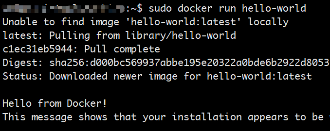
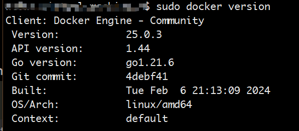
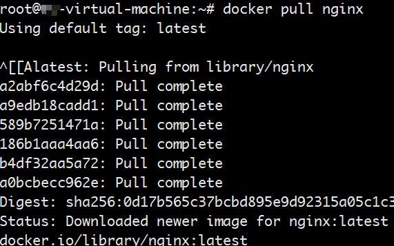
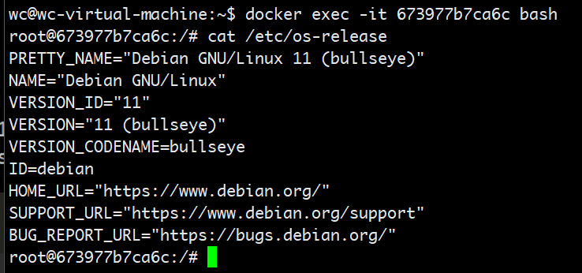
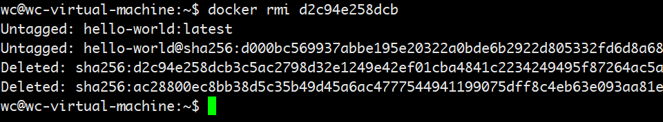
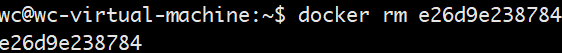
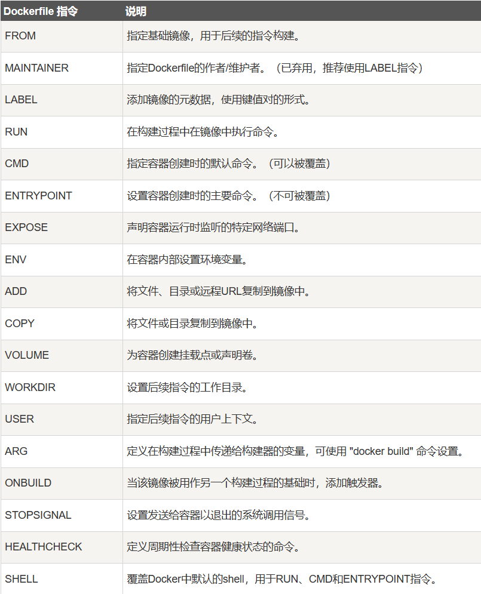

# docker学习

## ubuntu安装docker

1. 卸载自带的docker

```shell
apt remove docker docker-engine docker.io containerd runc
```

2. 更新Ubuntu软件包列表和已安装软件的版本

```shell
sudo apt update
```

3. 安装docker依赖

```shell
apt install ca-certificates curl gnupg lsb-release
```

4. 添加Docker官方GPG密钥

```shell
curl -fsSL http://mirrors.aliyun.com/docker-ce/linux/ubuntu/gpg | sudo apt-key add -
```

5. 添加Docker的软件源

```shell
sudo add-apt-repository "deb [arch=amd64] http://mirrors.aliyun.com/docker-ce/linux/ubuntu $(lsb_release -cs) stable"
```

6. 安装Docker

```shell
apt install docker-ce docker-ce-cli containerd.io
```

7. 配置用户组
   默认情况下，只有root用户和docker组的用户才能运行Docker命令。我们可以将当前用户添加到docker组，以避免每次使用Docker时都需要使用sudo。命令如下：

```shell
sudo usermod -aG docker $USER
```

8. 运行Docker

```shell
systemctl start docker
```


9. 安装工具

```shell
apt -y install apt-transport-https ca-certificates curl software-properties-common
```

10. 重启Docker

```shell
systemctl restart docker
```

11. 验证是否成功

```shell
sudo docker run hello-world
```



12. 查看docker版本

```shell
sudo docker version
```



## docker操作

1. 查看镜像

```shell
sudo docker images
```

2. 拉取镜像

```shell
# 搜索是否存在nginx的镜像
sudo docker search nginx
# 拉取nginx镜像
sudo docker pull 
```



3. 运行容器

```shell
# 运行容器
sudo docker run -d -p 81:80 nginx
# 运行并进入容器
sudo docker run -d -p 81:80 -it nginx bash
# -d 参数让容器在后台运行
# --rm 容器执行结束后自动从历史记录中删除这容器
# -p 参数让容器的80端口映射到主机的81端口  -p 宿主机端口：容器暴露端口
```

4. 查看运行中的容器

```shell
sudo docker ps
```

5. 停止容器

```shell
sudo docker stop 容器ID
```

6. 进入一个运行着的容器

```shell
sudo docker exec -it 容器ID bash
```



7. 删除镜像

```shell
sudo docker rmi 镜像ID
```

删除镜像之前，不能有依赖的容器记录，需要先删除容器记录可以先用 `docker ps -a`查询容器记录



8. 删除容器记录

```shell
sudo docker rm 容器ID
```



9. 导出镜像

```shell
docker image save hello-world > /opt/hello-world.tar
```

10. 导入镜像

```shell
docker image load -i /opt/hello-world.tar
```

11. 查看容器日志

```shell
sudo docker logs -f 容器ID
# -f 参数让容器日志实时输出
```

## dockerfile学习

```shell
sudo vim Dockerfile

# Dockerfile内容如下：  
```shell  
FROM nginx
RUN echo '<meta charset="utf-8">用docker运行nginx</meta>' > /usr/share/nginx/html/index.html

# 构建dockerfile镜像
dcoker build .

# 修改镜像名字
docker tag 镜像ID my-nginx

# 运行该镜像
docker run -d -p 80:80 my-nginx

```

## dockerfile指令



> **FROM**：定制的镜像都是基于 FROM 的镜像，这里的 nginx 就是定制需要的基础镜像

**RUN**：用于执行后面跟着的命令行命令。`RUN <命令行命令>`或者 `RUN ["可执行文件", "参数1", "参数2"]`


**COPY**：复制指令，从上下文目录中复制文件或者目录到容器里指定路径。

```shell
COPY [--chown=<user>:<group>] <源路径1>...  <目标路径>
COPY [--chown=<user>:<group>] ["<源路径1>",...  "<目标路径>"]
COPY hom* /mydir/
COPY hom?.txt /mydir/
```

**ADD**：ADD 指令和 COPY 的使用格类似（同样需求下，官方推荐使用 COPY）

* ADD 的优点：在执行 <源文件> 为 tar 压缩文件的话，压缩格式为 gzip, bzip2 以及 xz 的情况下，会自动复制并解压到 <目标路径>。
* ADD 的缺点：在不解压的前提下，无法复制 tar 压缩文件。会令镜像构建缓存失效，从而可能会令镜像构建变得比较缓慢。具体是否使用，可以根据是否需要自动解压来决定。

**CMD**：类似于 RUN 指令，用于运行程序，但二者运行的时间点不同:

* CMD 在docker run 时运行。
* RUN 是在 docker build。

```shell
CMD <shell 命令> 
CMD ["<可执行文件或命令>","<param1>","<param2>",...] 
CMD ["<param1>","<param2>",...]  # 该写法是为 ENTRYPOINT 指令指定的程序提供默认参数
```

**ENTRYPOINT**：类似于 CMD 指令，但其不会被 docker run 的命令行参数指定的指令所覆盖，而且这些命令行参数会被当作参数送给 ENTRYPOINT 指令指定的程序。

**WORKDIR**：指定工作目录。用 WORKDIR 指定的工作目录，会在构建镜像的每一层中都存在。以后各层的当前目录就被改为指定的目录，如该目录不存在，WORKDIR 会帮你建立目录。

docker build 构建镜像过程中的，每一个 RUN 命令都是新建的一层。只有通过 WORKDIR 创建的目录才会一直存在。

格式：`WORKDIR <工作目录路径>`

**EXPOSE**：仅仅只是声明端口。

作用：

- 帮助镜像使用者理解这个镜像服务的守护端口，以方便配置映射。
- 在运行时使用随机端口映射时，也就是 docker run -P 时，会自动随机映射 EXPOSE 的端口。
  格式：`EXPOSE <端口1> [<端口2>...]`

**ENV**：设置环境变量，定义了环境变量，那么在后续的指令中，就可以使用这个环境变量。
格式：

```bash
ENV <key> <value>
ENV <key1>=<value1> <key2>=<value2>...
```

**ARG**：设置构建时的变量。容器运行时就消失了。
格式：

```shell
ARG <key>=<value>
ARG <key>=<value>...
```

**VOLUME**： 声明一个或多个用于存放 Volume 数据卷的目录，然后，Docker 就会在构建时，自动创建这些目录。
格式：
```shell
VOLUME ["/data"]
VOLUME ["/data1", "/data2"]
```


## docker-compose

> Docker Compose是Docker的一个工具，它允许我们使用YAML文件来定义和管理多个Docker容器。

### 安装
```shell
sudo apt install docker-compose
```

### 启动
```shell
# 启动 -d后台启动容器
docker-compose up -d
```
> compose的关键选项：
-p：指定项目名称。
-f：指定配置文件。
建议：单独的项目放在一个文件夹下，而不指定-p和-f参数，这样用起来比较方便；因为如果指定这两个选项，那么在项目操作过程中需要每次都要指定这两个参数，否则compose指令就识别不到项目。所以直接以默认的方式（以当前文件夹作为项目名称，当前文件夹下的docker-compose.yml作为配置文件）执行。

### 使用

```shell
docker-compose ps
# 停止容器
docker-compose stop
# 删除容器
docker-compose down
# 删除容器和镜像
```

### yml配置指令参考
（1）version；Compose 文件格式有3个版本,分别为1, 2.x 和 3.x 目前主流的为 3.x 其支持 docker 1.13.0 及其以上的版本。

（2）build；指定镜像构建参数，其作用与docker build 命令一样。

```shell
build:
	# 上下文路径
	context: .
	# 指定构建镜像的 Dockerfile 文件名
	dockerfile: Dockerfile-compose
	# 添加构建参数，这是只能在构建过程中访问的环境变量。
	args:
	- http_proxy: GOPROXY.IO - A Global Proxy for Go Modules,Goproxy.cn,direct
	# 设置构建镜像的标签。
	labels:
	- "myhello:1.0"
	- "com.example.description=Accounting webapp"
	# target：多层构建，可以指定构建哪一层。
	# tags：指定镜像的tags
	tags:
	- "myhello:1.0.0"
	- "localhost:5000/myhello:1.0.0"
  ```

（3）command；覆盖容器启动的默认命令。
`command: ["bundle", "exec", "thin", "-p", "3000"]`

（4）container_name；指定自定义容器名称，而不是生成的默认名称。
`container_name: my-web-container`

（5）depends_on；设置依赖关系。

- vdocker-compose up ：以依赖性顺序启动服务。在以下示例中，先启动 db 和 redis ，才会启动web。
- docker-compose up SERVICE ：自动包含 SERVICE 的依赖项。在以下示例中，docker-compose up web 还将创建并启动 db 和 redis。
- docker-compose stop ：按依赖关系顺序停止服务。在以下示例中，web 在 db 和 redis 之前停止。
```shell
  version: "3.7"
  services:
    web:
      build: .
      depends_on:
        - db
        - redis
    redis:
      image: redis
    db:
      image: postgres
```
注意：web 服务不会等待 redis、db 完全启动 之后才启动。

（6）entrypoint；覆盖容器默认的 entrypoint。
`entrypoint: /code/entrypoint.sh`

（7）env_file；从文件添加环境变量，可以是单个值或列表的多个值。
`env_file: .env`

（8）environment；添加环境变量。您可以使用数组或字典、任何布尔值，布尔值需要用引号引起来，以确保 YML 解析器不会将其转换为 True 或 False。
```shell
environment:
  RACK_ENV: development
  SHOW: 'true'
```

（9）expose；暴露端口，但不映射到宿主机，只被连接的服务访问。
仅可以指定内部端口为参数：
```shell
expose:
	- "3000"
	- "8000"
```

（10）extra_hosts；添加主机名映射。类似 docker run --add-host。
```shell
extra_hosts:
	- "somehost:162.242.195.82"
	- "otherhost:50.31.209.229"
```
以上会在此服务的内部容器中 /etc/hosts 创建一个具有 ip 地址和主机名的映射关系：
```shell
162.242.195.82 somehost
50.31.209.229 otherhost
```

（11）healthcheck；用于检测 docker 服务是否健康运行。
```shell
healthcheck:
	test: ["CMD", "curl", "-f", "http://localhost"] # 设置检测程序
	interval: 1m30s # 设置检测间隔
	timeout: 10s # 设置检测超时时间
	retries: 3 # 设置重试次数
	start_period: 40s # 启动后，多少秒开始启动检测程序
```

（12）image；指定容器运行的镜像。
以下格式都可以：
```shell
image: redis
image: ubuntu:14.04
image: tutum/influxdb
image: example-registry.com:4000/postgresql
image: a4bc65fd # 镜像id
```

（13）logging；服务的日志记录配置。
driver：指定服务容器的日志记录驱动程序，默认值为json-file。有以下三个选项。
```shell
driver: "json-file"
driver: "syslog"
driver: "none"
```

（14）restart
no：当容器退出时，不要自动重新启动
on-failure[:max-retries]：仅当容器以非零退出状态退出时才重新启动。
always：无论退出状态如何，始终重新启动容器。无论容器的当前状态如何，容器也将始终在守护程序启动时启动
unless-stopped：无论退出状态如何，始终重新启动容器，包括守护程序启动时，除非容器在Docker守护程序停止之前处于停止状态。
```shell
restart: "no"
restart: always
restart: on-failure
restart: unless-stopped
```

（15）volumes；将主机的数据卷或着文件挂载到容器里。
```shell
version: "3.7"
services:
	db:
		image: postgres:latest
		volumes:
			- "/localhost/postgres.sock:/var/run/postgres/postgres.sock"
			- "/localhost/data:/var/lib/postgresql/data"
```

（16）networks；为容器指定网络。
```shell
services:
	frontend:
		image: awesome/webapp
		networks:
			front-tier:
				ipv4_address: 172.16.238.10
				ipv6_address: 2001:3984:3989::10
networks:
	front-tier:
		ipam:
			driver: default
			config:
				- subnet: "172.16.238.0/24"
				- subnet: "2001:3984:3989::/64"
```

> 下面是一个例子 docker-compose.yml
```shell
version: '3.7'
# 定义项目中的服务
services:
  # 名为web的服务
  web:
    # 根据配置构建镜像
    build:
      # 构建镜像的上下文
      context: .
      #构建镜像的dockerfile
      dockerfile: Dockerfile.compose
      # 构建参数
      args:
        http_proxy: https://proxy.golang.com.cn,https://goproxy.cn,direct
      # 设置labels元数据
      labels:
        myhello: 1.0
        com.example.description: "Accounting webapp"
      # 为构建的镜像指定tags
      tags:
      - "myhello:1.0.0"
      - "localhost:5000/myhello:1.0.0"
    # 指定容器名称
    container_name: "myweb"
    # 设置容器依赖关系,表示web服务依赖于redis服务
    depends_on:
    - redis
    # 运行容器的端口映射
    ports:
    - "80:80"
    # 覆盖容器的cmd指令
    command: ["--param1=1","--param2=2"]
    # 设置环境变量
    environment:
      env1: "a"
      env2: "b"
    # 健康检查
    healthcheck:
      # 检查命令
      #test: ["CMD","curl","http://localhost/health"]
      test: ["CMD-SHELL","statuscode=`curl -o /dev/null -s -w %{http_code} http://localhost/health`; [ $$statuscode -le 400 ] || exit 1"]
      # 检查时间间隔
      interval: 5s
      # 检查超时时间
      timeout: 1s
      # 重试次数，即连续失败指定次数则判定为不健康
      retries: 5
      # 设置容器初始化时间，再次期间不报告健康检查状态
      start_period: 5s
    # 使用定义的网络
    networks:
    - mynetwork
    - net1
  # 名为 redis的服务
  redis:
    # 服务启动镜像
    image: "redis:latest"
    container_name: "myredis"
    # 容器暴露端口
    expose:
    - 6379
    # 指定容器启动命令，即覆盖cmd指令
    command: redis-server --requirepass 123456
    # 数据卷设置
    volumes:
    - /data
    networks:
    - mynetwork
    - net2
# 定义网络
networks:
  net1: {}
  net2: {}
  mynetwork:
    ipam:
      driver: default
      config:
      - subnet: "172.16.238.0/24"

```
