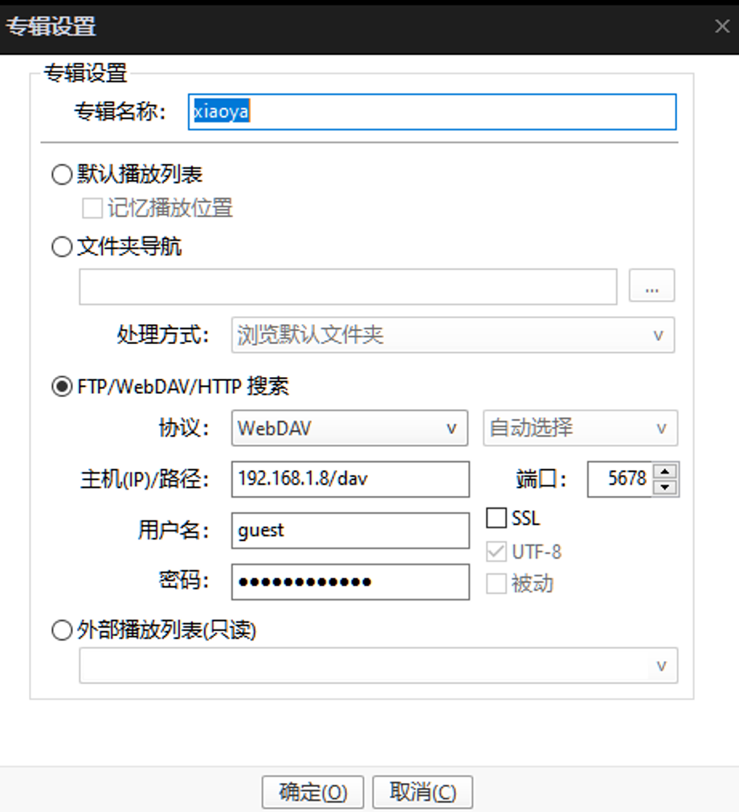
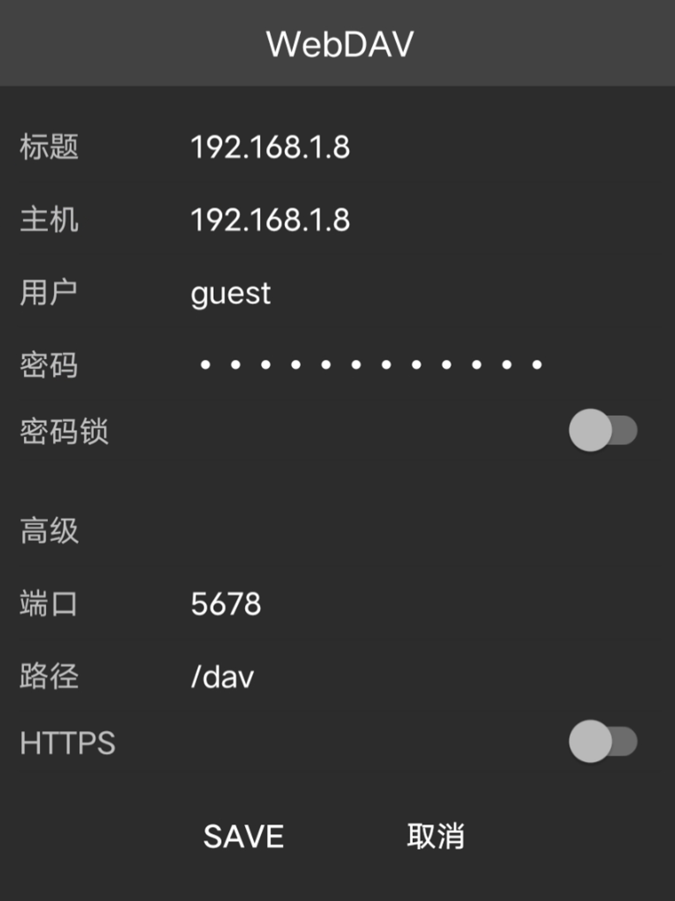
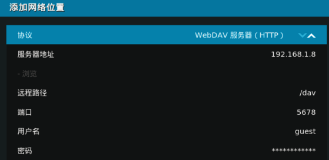
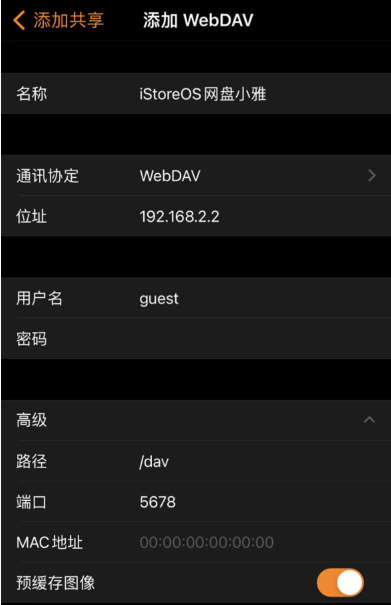
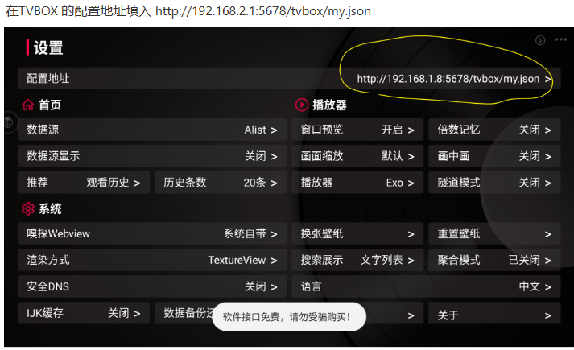

# 小雅alist部署（docker）

## 引用地址
[如何设置xiaoya的docker](https://xiaoyaliu.notion.site/xiaoya-docker-69404af849504fa5bcf9f2dd5ecaa75f)

## 安装

```bash
# 创建小雅的目录
mkdir -p /etc/xiaoya
touch mytoken.txt myopentoken.txt temp_transfer_folder_id.txt
# 下面是compose.yaml文件
version: "3.3"
services:
  alist:
    ports:
      - 5678:80
      - 2345:2345
      - 2346:2346
    volumes:
      - /etc/xiaoya:/data
    restart: always
    container_name: xiaoya
    image: xiaoyaliu/alist
networks: {}
# 启动
docker-compose up -d
```

注意：云服务器需要开房端口5678才可以访问

你需要配置好三个 `mytoken.txt myopentoken.txt temp_transfer_folder_id.txt`再安装：

| 对应文件                                | 获取方式                                                                                                                                     |
| --------------------------------------- | -------------------------------------------------------------------------------------------------------------------------------------------- |
| /etc/xiaoya/mytoken.txt                 | https://aliyuntoken.vercel.app/<br />https://alist.nn.ci/zh/guide/drivers/aliyundrive.html                   |
| /etc/xiaoya/myopentoken.txt             | https://alist.nn.ci/zh/guide/drivers/aliyundrive_open.html                                                                                   |
| /etc/xiaoya/temp_transfer_folder_id.txt | 阿里云盘资源盘创建一个目录，网址的最后一串字母就是<br />https://www.aliyundrive.com/drive/file/resource/**640xxxxxxxxxxxxxxxxxxxca8a** |

ALIST网址 `https://alist.nn.ci/guide/`

## 如何在播放器上通过webdav 连接 xiaoya的 docker

**webdav 账号密码**
用户: guest
密码: guest_Api789

potplayer


nplayer


Kodi


infuse


TVBOX

